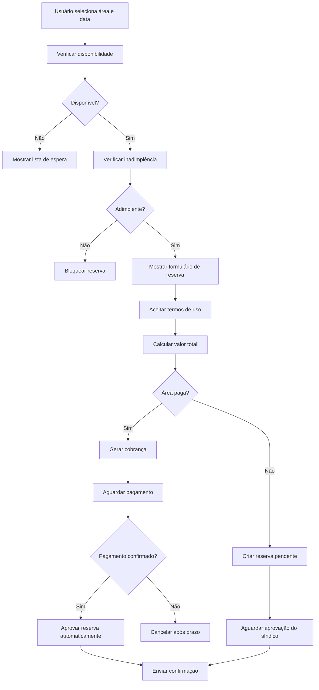
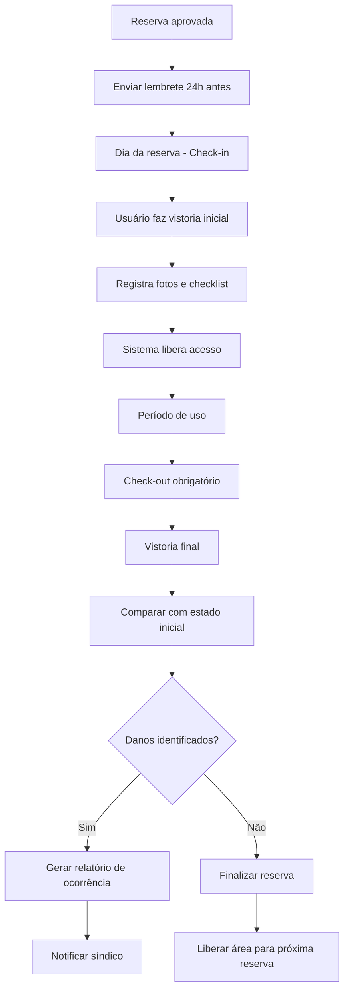

# Especificações Técnicas - Módulo de Reservas

## Arquitetura do Sistema

### Estrutura de Dados

```sql
-- Tabela de Áreas Comuns
CREATE TABLE common_areas (
    id UUID PRIMARY KEY,
    name VARCHAR(100) NOT NULL,
    description TEXT,
    capacity INTEGER NOT NULL,
    hourly_rate DECIMAL(10,2),
    images JSONB, -- Array de URLs das imagens
    amenities JSONB, -- Lista de itens inclusos
    rules TEXT,
    is_active BOOLEAN DEFAULT true,
    created_at TIMESTAMP DEFAULT NOW()
);

-- Tabela de Reservas
CREATE TABLE reservations (
    id UUID PRIMARY KEY,
    user_id UUID REFERENCES profiles(id),
    common_area_id UUID REFERENCES common_areas(id),
    reservation_date DATE NOT NULL,
    start_time TIME NOT NULL,
    end_time TIME NOT NULL,
    status VARCHAR(20) DEFAULT 'pending', -- pending, approved, rejected, cancelled
    guest_list JSONB, -- Lista de convidados
    total_amount DECIMAL(10,2),
    payment_status VARCHAR(20) DEFAULT 'pending',
    payment_id VARCHAR(100),
    terms_accepted_at TIMESTAMP,
    created_at TIMESTAMP DEFAULT NOW(),
    approved_at TIMESTAMP,
    approved_by UUID REFERENCES profiles(id)
);

-- Tabela de Regras por Área
CREATE TABLE area_rules (
    id UUID PRIMARY KEY,
    common_area_id UUID REFERENCES common_areas(id),
    rule_type VARCHAR(50), -- max_reservations_per_month, min_advance_days, etc.
    rule_value JSONB,
    is_active BOOLEAN DEFAULT true
);

-- Tabela de Lista de Espera
CREATE TABLE waiting_list (
    id UUID PRIMARY KEY,
    user_id UUID REFERENCES profiles(id),
    common_area_id UUID REFERENCES common_areas(id),
    desired_date DATE,
    desired_start_time TIME,
    desired_end_time TIME,
    position INTEGER,
    created_at TIMESTAMP DEFAULT NOW(),
    notified_at TIMESTAMP
);

-- Tabela de Vistoria
CREATE TABLE inspections (
    id UUID PRIMARY KEY,
    reservation_id UUID REFERENCES reservations(id),
    type VARCHAR(20), -- checkin, checkout
    checklist_data JSONB,
    photos JSONB, -- Array de URLs das fotos
    observations TEXT,
    created_at TIMESTAMP DEFAULT NOW(),
    created_by UUID REFERENCES profiles(id)
);

-- Tabela de Itens Extras
CREATE TABLE extra_items (
    id UUID PRIMARY KEY,
    name VARCHAR(100) NOT NULL,
    description TEXT,
    rental_price DECIMAL(10,2),
    quantity_available INTEGER,
    common_area_id UUID REFERENCES common_areas(id),
    is_active BOOLEAN DEFAULT true
);

-- Tabela de Reservas de Itens Extras
CREATE TABLE reservation_extra_items (
    id UUID PRIMARY KEY,
    reservation_id UUID REFERENCES reservations(id),
    extra_item_id UUID REFERENCES extra_items(id),
    quantity INTEGER,
    unit_price DECIMAL(10,2)
);
```

### APIs Principais

#### 1. API de Calendário
```typescript
// GET /api/calendar/{area_id}?month=2024-01&view=month
interface CalendarResponse {
  dates: {
    date: string;
    status: 'available' | 'pending' | 'reserved' | 'blocked';
    reservations: ReservationSummary[];
  }[];
  area: CommonArea;
}

// GET /api/calendar/availability
interface AvailabilityRequest {
  area_id: string;
  date: string;
  start_time: string;
  end_time: string;
}
```

#### 2. API de Reservas
```typescript
// POST /api/reservations
interface CreateReservationRequest {
  common_area_id: string;
  reservation_date: string;
  start_time: string;
  end_time: string;
  guest_list?: Guest[];
  extra_items?: ExtraItemRequest[];
  terms_accepted: boolean;
}

// PUT /api/reservations/{id}/status
interface UpdateReservationStatusRequest {
  status: 'approved' | 'rejected';
  reason?: string;
}
```

#### 3. API de Pagamentos
```typescript
// POST /api/payments/generate
interface GeneratePaymentRequest {
  reservation_id: string;
  payment_method: 'pix' | 'boleto' | 'card';
}

interface PaymentResponse {
  payment_id: string;
  payment_url?: string;
  pix_code?: string;
  boleto_url?: string;
  expires_at: string;
}
```

### Fluxos de Negócio

#### Fluxo de Reserva


#### Fluxo de Vistoria


### Componentes Frontend

#### 1. Calendário Interativo
```typescript
// components/ReservationCalendar.tsx
interface CalendarProps {
  areaId: string;
  onDateSelect: (date: Date) => void;
  view: 'month' | 'week';
}

const ReservationCalendar: React.FC<CalendarProps> = ({
  areaId,
  onDateSelect,
  view
}) => {
  const { data: calendar } = useCalendar(areaId, view);
  
  return (
    <div className="calendar-container">
      {/* Implementação do calendário */}
    </div>
  );
};
```

#### 2. Formulário de Reserva
```typescript
// components/ReservationForm.tsx
interface ReservationFormProps {
  area: CommonArea;
  selectedDate: Date;
  onSubmit: (data: ReservationData) => void;
}

const ReservationForm: React.FC<ReservationFormProps> = ({
  area,
  selectedDate,
  onSubmit
}) => {
  const [guestList, setGuestList] = useState<Guest[]>([]);
  const [extraItems, setExtraItems] = useState<ExtraItemSelection[]>([]);
  const [termsAccepted, setTermsAccepted] = useState(false);
  
  return (
    <form onSubmit={handleSubmit}>
      {/* Campos do formulário */}
    </form>
  );
};
```

### Hooks Customizados

```typescript
// hooks/useReservations.ts
export const useReservations = (userId?: string) => {
  return useQuery({
    queryKey: ['reservations', userId],
    queryFn: () => fetchReservations(userId),
  });
};

// hooks/useCalendar.ts
export const useCalendar = (areaId: string, view: string) => {
  return useQuery({
    queryKey: ['calendar', areaId, view],
    queryFn: () => fetchCalendar(areaId, view),
    refetchInterval: 30000, // Atualiza a cada 30 segundos
  });
};

// hooks/usePayment.ts
export const usePayment = () => {
  return useMutation({
    mutationFn: generatePayment,
    onSuccess: (data) => {
      // Redirecionar para pagamento ou mostrar QR code
    },
  });
};
```

### Sistema de Notificações

```typescript
// services/NotificationService.ts
class NotificationService {
  async sendReservationReminder(reservationId: string) {
    const reservation = await getReservation(reservationId);
    const user = await getUser(reservation.user_id);
    
    // Email
    await this.emailService.send({
      to: user.email,
      template: 'reservation-reminder',
      data: { reservation, user }
    });
    
    // Push notification
    await this.pushService.send({
      userId: user.id,
      title: 'Lembrete de Reserva',
      body: `Sua reserva é amanhã às ${reservation.start_time}`
    });
  }
  
  async notifyWaitingList(areaId: string, date: string) {
    const waitingUsers = await getWaitingList(areaId, date);
    
    for (const user of waitingUsers) {
      await this.sendWaitingListNotification(user);
    }
  }
}
```

### Validações e Regras de Negócio

```typescript
// services/ReservationRules.ts
class ReservationRulesEngine {
  async validateReservation(request: CreateReservationRequest, userId: string) {
    const rules = await this.getRules(request.common_area_id);
    const user = await getUser(userId);
    
    // Verificar inadimplência
    if (await this.isUserInDebt(userId)) {
      throw new Error('Usuário possui pendências financeiras');
    }
    
    // Verificar limite de reservas por mês
    const monthlyLimit = rules.find(r => r.rule_type === 'max_reservations_per_month');
    if (monthlyLimit) {
      const currentMonthReservations = await this.getUserMonthlyReservations(userId);
      if (currentMonthReservations >= monthlyLimit.rule_value.limit) {
        throw new Error('Limite mensal de reservas atingido');
      }
    }
    
    // Verificar antecedência mínima
    const minAdvance = rules.find(r => r.rule_type === 'min_advance_days');
    if (minAdvance) {
      const daysDifference = this.calculateDaysDifference(new Date(), request.reservation_date);
      if (daysDifference < minAdvance.rule_value.days) {
        throw new Error(`Reserva deve ser feita com pelo menos ${minAdvance.rule_value.days} dias de antecedência`);
      }
    }
    
    return true;
  }
}
```

### Integração com Pagamentos

```typescript
// services/PaymentService.ts
class PaymentService {
  async generatePixPayment(reservationId: string, amount: number) {
    const response = await this.mercadoPagoClient.payment.create({
      transaction_amount: amount,
      description: `Reserva de área comum - ${reservationId}`,
      payment_method_id: 'pix',
      payer: {
        email: user.email,
      },
      notification_url: `${process.env.API_URL}/webhooks/mercadopago`,
    });
    
    return {
      payment_id: response.id,
      qr_code: response.point_of_interaction.transaction_data.qr_code,
      qr_code_base64: response.point_of_interaction.transaction_data.qr_code_base64,
    };
  }
  
  async handlePaymentWebhook(paymentId: string) {
    const payment = await this.mercadoPagoClient.payment.findById(paymentId);
    
    if (payment.status === 'approved') {
      await this.confirmReservationPayment(payment.external_reference);
    }
  }
}
```

### Testes Automatizados

```typescript
// tests/ReservationFlow.test.ts
describe('Fluxo de Reserva', () => {
  test('deve criar reserva com sucesso para área gratuita', async () => {
    const user = await createTestUser();
    const area = await createTestArea({ hourly_rate: 0 });
    
    const reservation = await createReservation({
      user_id: user.id,
      common_area_id: area.id,
      reservation_date: '2024-02-15',
      start_time: '14:00',
      end_time: '18:00',
    });
    
    expect(reservation.status).toBe('pending');
    expect(reservation.payment_status).toBe('not_required');
  });
  
  test('deve bloquear reserva para usuário inadimplente', async () => {
    const user = await createTestUser({ has_debt: true });
    const area = await createTestArea();
    
    await expect(createReservation({
      user_id: user.id,
      common_area_id: area.id,
      reservation_date: '2024-02-15',
      start_time: '14:00',
      end_time: '18:00',
    })).rejects.toThrow('Usuário possui pendências financeiras');
  });
});
```

### Monitoramento e Métricas

```typescript
// services/MetricsService.ts
class MetricsService {
  async trackReservationCreated(reservationId: string) {
    await this.analytics.track('reservation_created', {
      reservation_id: reservationId,
      timestamp: new Date(),
    });
  }
  
  async generateUsageReport(startDate: Date, endDate: Date) {
    return {
      total_reservations: await this.countReservations(startDate, endDate),
      revenue: await this.calculateRevenue(startDate, endDate),
      most_popular_areas: await this.getMostPopularAreas(startDate, endDate),
      peak_hours: await this.getPeakHours(startDate, endDate),
    };
  }
}
```

### Configuração de Deploy

```yaml
# docker-compose.yml
version: '3.8'
services:
  app:
    build: .
    ports:
      - "3000:3000"
    environment:
      - DATABASE_URL=${DATABASE_URL}
      - REDIS_URL=${REDIS_URL}
      - MERCADOPAGO_ACCESS_TOKEN=${MERCADOPAGO_ACCESS_TOKEN}
    depends_on:
      - postgres
      - redis
  
  postgres:
    image: postgres:15
    environment:
      POSTGRES_DB: reservations
      POSTGRES_USER: ${DB_USER}
      POSTGRES_PASSWORD: ${DB_PASSWORD}
    volumes:
      - postgres_data:/var/lib/postgresql/data
  
  redis:
    image: redis:7-alpine
    ports:
      - "6379:6379"

volumes:
  postgres_data:
```

Este documento técnico complementa o plano de evolução e fornece a base para implementação detalhada de cada funcionalidade.